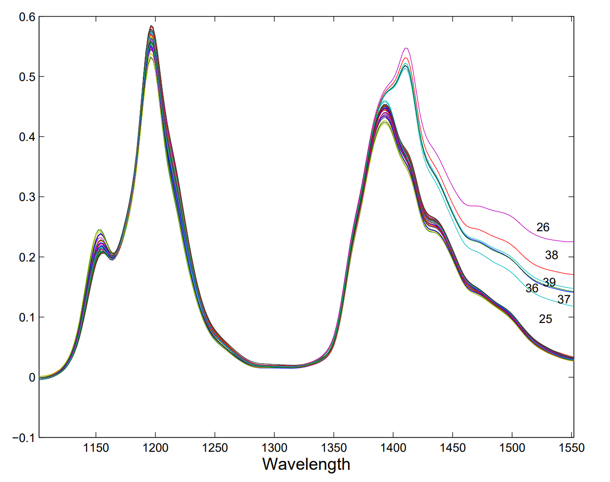
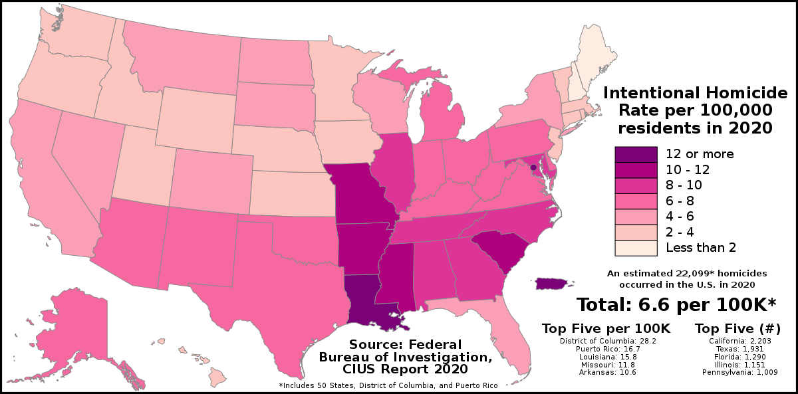

```{r setup, include=FALSE}
knitr::opts_chunk$set(echo = TRUE, message = FALSE, warning = FALSE)
```

```{r Directory, include=FALSE}
library(tidyverse)
library(DT)
library(kableExtra)
setwd("C:/Users/dfdop/Desktop/New folder/MRCD_R_2")
```
# Aplicación con Datos Reales

A continuación ilustraremos la implementación de la estimación de la matriz de varianzas y covarianzas MRCD para dos conjuntos de datos los cuales tiene un número pequeño de $n/p$   (Recordemos que $n/p$ es el número de condición, de ensayos empiricos sabemos que un número de condición óptimo es $10$). Para ambos casos la matriz objetivo implementada corresponde a la matriz $\textbf{I}_n$

## Distancia de Mahalanobis Robusta para alta dimensionalidad

$$RD\left(\textbf{x}_i\right)= \sqrt{\left(\textbf{x}_i-\textbf{m}_{MRCD}\right)^{\prime}\textbf{K}^{-1}_{MRCD}\left(\textbf{x}_i-\textbf{m}_{MRCD}\right)}$$

## Norma de Frobenius 

\begin{equation*}
        L_3\left(\boldsymbol{\hat{\Sigma}},\boldsymbol{\Sigma}\right) = p^{-1}\parallel\boldsymbol{\hat{\Sigma}}- \boldsymbol{\Sigma}\parallel^2 = p^{-1}\text{tr}\left(\boldsymbol{\hat{\Sigma}}- \boldsymbol{\Sigma}\right)^2
    \end{equation*}
    Definida a través del producto interno $\langle A,B \rangle= p^{-1}\text{tr}\left(A^\prime B\right)$

## Función objetivo 

\begin{align*}
            \textbf{K}\left(H\right)= \rho\textbf{T}+\left(1- \rho\right)c_\alpha \textbf{S}_U\left(H\right) 
        \end{align*}


# Octanaje


Los datos de octano, consisten en espectros de absorbancia NIR sobre $p = 226$ longitudes de onda que van desde $1102$ a $1552$ nm con mediciones cada dos nm. Para cada una de las $n = 39$ muestras de producción de gasolina se midió el número de octano y, por lo tanto tenemos una respuesta univairda.

Este conjunto de datos ha sido estudiado antes en otras investigaciones. Es bien sabido que el conjunto de datos de octanaje contiene seis valores atípicos a los que se agregó alcohol. En la Figura 1 vemos que los espectros de esas seis muestras se destacan claramente. También se detectaron aplicando el método PCA robusto ROBPCA a los $226$ regresores. Por lo tanto, ponemos el conjunto de observaciones regulares $G_r$ igual a los datos completos de $39$ observaciones menos estos seis valores atípicos.


```{r include=FALSE}
data = read.csv( paste( getwd(),"/octane.csv",sep=""),header=F)
aux = head(data)
```
```{r echo=FALSE}
aux %>%
  kbl() %>%
  kable_styling()
```




```{r octano}
###############
# Octane data:
# Application that illustrates the MRCD subset selection and the MRCD outlier detection analysis
###############

rm(list = ls())  # cleanup

#setwd!

sapply(list("MRCD.R","optimalh.R"),source)

library('rrcov') #for PcaHubert

# 1. Read data
#--------------

data = read.csv( paste( getwd(),"/octane.csv",sep=""),header=F)
octane = data[,2:dim(data)[2]]
dim(octane) # n x p = 39 x 226
n = dim(octane)[1]
p = dim(octane)[2]
obs = 1:n

# 2. Apply ROBPCA (robust PCA analysis)
#--------------------------------------
robpca = PcaHubert(octane, k=2, kmax=p, alpha=0.75, mcd=FALSE)
outl.robpca = obs[robpca@flag==FALSE]; outl.robpca
# Observations flagged as outliers by ROBPCA:
# 25, 26, 36, 37, 38, 39

# Plot the orthogonal distances versus the score distances
pch = rep(20,n); pch[robpca@flag==FALSE] = 17
col = rep('black',n); col[robpca@flag==FALSE] = 'red'
plot(robpca, pch=pch, col=col)


# 3. Apply MRCD for outlier detection
#------------------------------------

mX=t(octane)

# Select optimal h

start.time <- Sys.time()
#consider all possible h-values
seth=seq(ceiling(dim(mX)[2]/2),dim(mX)[2],1)
hresult=optimalh(mX=mX, seth=seth)
end.time <- Sys.time()
#computation time needed
time.taken <- end.time - start.time
time.taken


plot(seth,hresult$obj, xlab="subset size h", ylab="MRCD objective function",xaxt="n")
axis(1, at = seth, las=2)

msecov=c()
for (i in 1:(length(seth)-1)){
  msecov[i]=mean((hresult$ccc[[i+1]]-hresult$ccc[[i]])^2)
}
plot(seth[-1],msecov, xlab="subset size h", ylab="Frobenius distance between K(h) and K(20)", xaxt="n") 
axis(1, at = seth[-1], las=2)

hopt=33

result = mrcd(mX=mX,h=hopt)

dist=mahalanobis(octane, center=result$mu, cov=result$icov, inverted=TRUE)

#postscript("octanedist.eps",width=8,height=5,horizontal=FALSE)
par(mar=c(4,4,2,2))
plot(sqrt(dist), xlab='Index i', ylab='MRCD robust distance', main='', pch=pch, col=col)
#dev.off()

result$rho
```

# Datos de la tasa de homicidios

Khan et al. (2007) hacen una regresión de la tasa de homicidios por cada $100.000$ residentes en los $n = 50$ estados de los EE. UU. en $1980$ en $25$ predictores demográficos y mencionan que las herramientas gráficas revelan un valor atípico claro.



```{r include=FALSE}
murderdata = read.table("demoUSA.txt",header=TRUE)
aux2 = head(murderdata)
```
```{r echo=FALSE}
aux2 %>%
  kbl() %>%
  kable_styling()
```


```{r murder}
###############
# Murder rate data
# Application that illustrates the MRCD subset selection and the MRCD covariance based regression analysis
# Data is taken from Khan et al. (2007), as published on http://users.ugent.be/~svaelst/software/RLARS.html 
###############

rm(list = ls())  # cleanup

#setwd!

sapply(list("MRCD.R","optimalh.R", "MRCDreg.R"),source)


# 1. Read data
#--------------

murderdata = read.table("demoUSA.txt",header=TRUE)
statenames = murderdata[,1] # first column has the names of the states
murderdata = murderdata[,-1]
rownames(murderdata) = statenames

y = matrix(murderdata[,"M"],ncol=1) # murder rate is the dependent variable
xnames = setdiff(colnames(murderdata),"M")
X = data.matrix( murderdata[,xnames])

# 2. Apply MRCD for regressions
#------------------------------

mX = cbind(y,X) # MRD regression is done on the joint data y+X, as explained in Rousseeuw et al. (2004)

# Select optimal h

start.time <- Sys.time()
seth=seq(ceiling(dim(mX)[1]/2),dim(mX)[1],1)
hresult= optimalh(mX=t(mX), seth=seth)
end.time <- Sys.time()
time.taken <- end.time - start.time
time.taken

plot(seth,hresult$obj, xlab="subset size h", ylab="MRCD objective function",xaxt="n")
axis(1, at = seth, las=2)

msecov=c()
for (i in 1:(length(seth)-1)){
  msecov[i]=mean((hresult$ccc[[i+1]]-hresult$ccc[[i]])^2)
}
plot(seth[-1],msecov, xlab="subset size h", ylab="Frobenius distance between K(h) and K(h-1)", xaxt="n")  
axis(1, at = seth[-1], las=2)


# MRCD regression
mrcd = MRCDreg(y=y,X=X,alpha=44/50)
estbeta = mrcd$coef
# OLS regression
OLSbeta = lm(y ~X)$coef[-1]

select = c(23)
#postscript("betas.eps",width=8,height=5,horizontal=FALSE)
par(mfrow=c(1,1))
par(mar=c(4,4,2,2))
plot(OLSbeta,estbeta,xlab="OLS coefficients",ylab="MRCD coefficients",ylim=c(-1.65,1.3))
text( OLSbeta[select],estbeta[select],colnames(X)[select],cex=0.8,pos=1)
abline(a=0,b=1,lty=3)
abline(h=0,lty=3)
abline(v=0,lty=3)
#dev.off()

data.frame( 1:25, names(OLSbeta) , OLSbeta,estbeta)[select,]

subset = mrcd$index
outliers = setdiff(1:length(y),subset)

#postscript("phones.eps",width=8,height=5,horizontal=FALSE)
par(mfrow=c(1,1))
par(mar=c(4,6,2,2))
plot(X[,"PH"],y ,col="white", xlab="Number of telephones per 100 residents" , ylab="Number of murders \n per 100,000 residents")
text( x=42, y=190 ,expression( beta[OLS]==-0.48~ vs  ~beta[MRCD]==-0.76 ))
lines(X[subset,"PH"],y[subset] ,type="p",col="gray",pch=18)
lines(X[outliers,"PH"],y[outliers] ,type="p", col="red",pch=17)
text( X[outliers,"PH"],y[outliers] ,names(X[outliers,"PH"]),cex=0.8,pos=1)
#dev.off()

```

